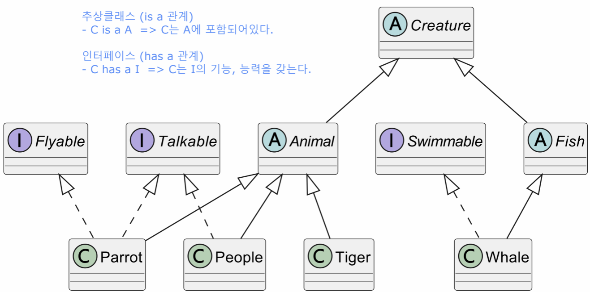
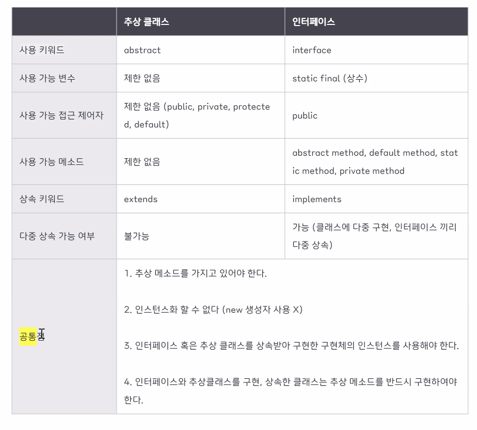

## ch8. 인터페이스
### `인터페이스 개념`
#### 1. 인터페이스란?
여러 클래스에서 반드시 구현해야 할 공통 기능들을 ‘껍데기’만 정의해놓은 ‘타입’

<br>

(사용 예시)
```java
public interface Payment {
    void processPayment(double amount); // 결제를 처리하는 기능 담당
}
```
-> Payment 인터페이스는, 결제를 처리하는 기능 담당 메서드를 정의
```java
// CreditCard 클래스에서 결제 로직 구현
public class CreditCard implements Payment {
    private String cardNumber;           // 신용카드 결제에 필요한 카드 번호

    // 생성자
    public CreditCard(String cardNumber) {
        this.cardNumber = cardNumber;
    }

    @Override
    public void processPayment(double amount) {
        System.out.println("Processing credit card payment of $" + amount + " using card number: " + cardNumber);
        //todo 실제 카드 결제 로직
    }
}
```
- CreditCard 클래스는, Payment 인터페이스를 구현하며 신용카드 결제를 처리합니다.
- 카드 번호를 저장하는 cardNumber 변수를 생성자에서 초기화 합니다.
- processPayment 메서드에서는 카드 번호를 사용하여 결제를 처리하는 메시지를 출력합니다.
```java
// PayPal 클래스를 통해 결제를 구현
public class PayPal implements Payment {
    private String email;

    // 생성자
    public PayPal(String email) {
        this.email = email;
    }

    @Override
    public void processPayment(double amount) {
        System.out.println("Processing PayPal payment of $" + amount + " using email: " + email);
        //todo 실제 PayPal 결제 로직
    }
}
```
이를 실행하는 PaymentProcess 클래스를 만들어 실행한다. 
```java
public class Main {
    public static void main(String[] args) {
        Payment creditCardPayment = new CreditCard("1234-5678-9012-3456");
        Payment payPalPayment = new PayPal("user@example.com");

        creditCardPayment.processPayment(150.00);
        payPalPayment.processPayment(75.00);
    }
}
```
-> 위 예시처럼 Payment 인터페이스가 결제 처리 방식에 상관없이 일관된 인터페이스를 제공하고 있다.

<br>

### `인터페이스 구현`
#### 1. 인터페이스로 구현
```java
// 변경 전
class ZooKeeper {
	void feed(Tiger tiger) {  // 호랑이가 오면 고기를 던져 준다.
		System.out.println("feed meat");
	}

	void feed(Lion lion) {    // 사자가 오면 생선을 던져준다.
		System.out.println("feed fish");
	}
}
```
```java
// 변경 후
class ZooKeeper {
	void feed(Predator predator) {
		System.out.println("feed meat");
	}
}
...
```
tiger, lion은 각각 Tiger, Lion의 객체 이기도 하지만 Predator 인터페이스의 객체 이기도 하기 때문에 이와같이 Predator를 `자료형`으로 사용할 수 있는 것입니다. (인터페이스의 다형성)

-> 인터페이스(Predator)를 정의하여 인터페이스를 기준으로 메서드(feed)를 만드는 것이 효율적

<br>

#### 2. 인터페이스 메소드 구현

이번에는 Predator 인터페이스에 다음과 같은 getFood 메소드를 추가
```java
interface Predator {
    String getFood();
}
```
다음처럼 Tiger, Lion 클래스에 getFood() 메소드를 구현해야 한다.
```java
class Tiger implements Predator {
	@Override
	public String getFood() {
		return "meat";
	}
}

class Lion implements Predator {
	@Override
	public String getFood() {
		return "fish";
	}
}
```
인터페이스 구현체로 변경 후 Zookeeper의 feed 메소드만 Predator.getFood 구현체를 호출하도록 변경하면 된다.
```java
class ZooKeeper {
	void feed(Predator predator) {
		System.out.println("feed " + predator.getFood());
	}
}
```
```java
public static void main(String[] args) {
		ZooKeeper zookeeper = new ZooKeeper();

		Tiger tiger = new Tiger();    // Predator tiger = new Tiger() 선언 가능
		zookeeper.feed(tiger);
		
		Lion lion = new Lion();       // Predator lion = new Lion() 선언 가능
		zookeeper.feed(lion);
	}
```
```
feed meat
feed fish
```

<br>

#### 3. 인터페이스 타입 선언
인터페이스로 구현 객체를 사용할 때, 다음과 같이 인터페이스 타입으로 변수를 선언하고, 구현 객체를 대입해도 된다.

(예시)
```java
Predator anything = new Lion();
or 
Predator anything = new Tiger();
```
개발 코드에서 인터페이스는 **클래스의 필드, 생성자 또는 메소드의 매개 변수, 생성자 또는 메소드의 로컬 변수**로 선언될 수 있다.

<br>

### `인터페이스 상속`
인터페이스도 다른 인터페이스를 상속할 수 있습니다. 인터페이스는 클래스와는 다르게 **다중 상속**을 허용한다. 

```java
public interface 하위인터페이스 extends 상위인터페이스1, 상위인터페이스2, ... { 
		...
}
```
하위 인터페이스를 구현하는 클래스는 하위 메소드 뿐만 아니라 상위 인터페이스의 모든 추상 메소드에 대한 실체 메소드를 갖고있어야 한다.

<br>

### `인터페이스의 다형성`
다형성은 하나의 타입에 대입되는 객체에 따라 실행 결과가 다양한 형태로 나오는 성질을 말한다.

<br>

```java
public class ProfileService {
    ProfileRepository repository;

    public void saveProfile() {
        repository = new ProfileDBRepository();   // 이 부분만 바꿔 끼우면 됨
        repository.save();
    }
}
```
프로그램 소스코드는 크게 변함이 없는데, 구현 객체를 교체하면서 프로그램의 실행 결과가 다양해집니다. 이것이 바로 `인터페이스의 다형성`이다.

<br>

또는 이런 형태도 가능합니다. ProfileService 클래스 사용처에서 ProfileRepository의 구현체를 매개값으로 전달해준다면, 저장방식(Repository)에 변화가 있더라도 ProfileService 클래스에서는 단 한줄의 코드 변경 없이 실행이 달라질 수 있다.
```java
public class ProfileService {
    public void saveProfile(ProfileRepository repository) {
        repository.save();
    }
}
```
참고로 인터페이스는 매개변수에서도, 필드에서도 선언 가능하다.

<br>

#### 1. 자동타입변환
구현 객체가 인터페이스 타입으로 변환되는 것은 자동타입변환에 해당합니다.
```java
인터페이스명 변수 = 구현객체;   // 구현객체로 자동 타입변환
```
```java
public class DriverExample {
    public static void main(String[] args) {
        Driver driver = new Driver();
        Vehicle taxi = new Taxi();
        driver.drive(taxi);     // 전달한 구현 객체로 자동 타입 변환 : Vehicle vehicle = taxi; 
        
        Vehicle bus = new Bus();
        driver.drive(bus);      // 전달한 구현 객체로 자동 타입 변환 : Vehicle vehicle = bus;
    }
}
```

<br>

#### 2. 객체 타입 확인 (instanceof)
어떤 구현 객체가 인터페이스 타입으로 변환되었는지 확인할 수 있는 방법이 있다. 방법은 바로 `instanceof` 연산자를 사용하는 것 이다. 다음과 같이 연산자 형태로 사용되고, 결과는 true/false 로 리턴한다.

<br>

```java
public class Driver {
    public void drive(Vehicle vehicle) {
        if (vehicle instanceof Bus) {
            System.out.println("Bus//");
        }

        if (vehicle instanceof Taxi) {
            System.out.println("Taxi//");
        }

        vehicle.run();
    }
}
```
```
Taxi//
택시가 달립니다!
Bus//
버스가 달립니다!
```

<br>

### `디폴트 메소드`
자바8 버전 이후부터는 디폴트 메소드(default method)를 사용할 수 있다. 인터페이스의 메소드는 구현체를 가질 수 없지만 디폴트 메소드를 사용하면 실제 구현된 형태의 메소드를 가질 수 있다.
```java
interface Predator {
	String getFood();

	// 디폴트 메소드
	default void printFood() {   
		System.out.printf("my food is %s\n", getFood());
	}
}
```
이렇게 Predator 인터페이스에 디폴트 메소드를 구현하면 Predator 인터페이스를 구현한 Tiger, Lion 등의 실제 클래스는 printFood() 메소드를 구현하지 않아도 공통으로 사용할 수 있다.
그리고 디폴트 메소드는 `오버라이딩`이 가능해서 printFood 메소드를 실제 클래스에서 다르게 구현하여 사용할 수도 있다.


<br>






```
< ch7 수업 메모 >

추상 클래스 vs 인터페이스 차이
추상 클래스는 하나만 상속 가능, 다중 상속 불가
인터페이스는 다중 상속, 다중 구현 가능 

추상클래스는 -> 필드, 생성자, 메소드 O
인터페이스는 -> 상수, 추상메소드, default 메소드
일반 변수, 일반 메소드 생성 불가
ex) int speed = 34; // static final 상수로 생성

List<Integer> list = new ArrayList();
ArrayList<> list = new ArrayList();

List<Integer> list2 = new LinkedList()
LinkedList<> list2 = new LinkedList();
-> 인터페이스의 유연성
```

<br>

## Weekly Quiz

1. 아래 그림과 같은 클래스와 인터페이스를 생성하고, 기능을 구현하세요.


-> [과제 레포](https://github.com/zeonzyeon/interface-quiz)