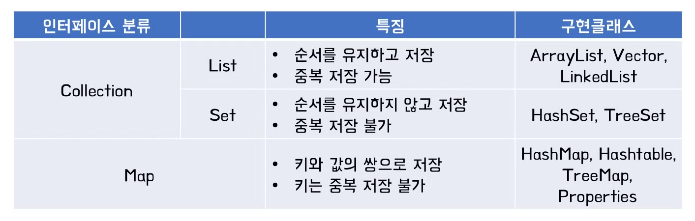

## ch11. 컬렉션
### `Collection`

컬렉션이란 사전적 의미로 요소를 수집해서 저장하는 것을 말한다.

<br>

< 배열의 단점 > 

저장할 수 있는 객체 수가 배열을 생성할 때 결정되기 때문에 불특정 다수의 객체를 저장하기에는 문제가 있다. 또 객체를 삭제했을 때 해당 인덱스가 비게 된다. 그렇기 때문에 새로운 객체를 저장하려면 어디가 비어있는지 확인하는 코드도 필요하다.

자바에서는 몇가지 컬렉션 인터페이스를 통해 다양한 형태의 자료구조를 제공해주는데, 주요 인터페이스로 List, Set, Map이 있다.



<br>

### `List - ArrayList, LinkedList`
List 컬렉션은 객체를 일렬로 늘어놓은 구조를 가지고 있다. 자료형의 개수가 계속 변하는 상황에서 유리한 자료구조 형태가 바로 List이다. List 컬렉션은 객체 자체를 저장하는게 아니라 다음 그림과 같이 `객체의 번지를 참조`한다.

<br>

전체 객체를 대상으로 하나씩 반복해서 저장된 객체를 얻고 싶다면 다음과 같이 for문을 사용할 수 있습니다.
```java
List<String> list = ...;
for (int i = 0; i < list.size; i++) {
	String str = list.get(i);  // i 인덱스에 저장된 String 객체를 가져옴
}
```

인덱스 번호가 필요 없다면 `향상된 for문`을 이용하는 것이 더욱 편리합니다.

```java
for (String str : list) {   // 저장된 list 총 갯수만큼 루핑
}
```

<br>

#### < List 인터페이스의 메소드 >
| 기능 | 메소드 | 설명 |
| --- | --- | --- |
| 객체 추가 | boolean add(E e) | 주어진 객체를 맨 끝에 추가 |
|  | void add(int index, E element) | 주어진 인덱스에 객체를 추가 |
|  | set(int index, E element) | 주어진 인덱스에 저장된 객체를 주어진 객체로 바꿈 |
| 객체 검색 | boolean contains(Object o) | 주어진 객체가 저장되어있는지 여부 |
|  | E get(int index) | 주어진 인덱스에 저장된 객체를 리턴 |
|  | isEmpty() | 컬렉션이 비어있는지 여부 |
|  | int size() | 저장되어 있는 전체 객체 수 리턴 |
| 객체 삭제 | void clear() | 저장된 모든 객체를 삭제 |
|  | E remove(int index) | 주어진 인덱스에 저장된 객체를 삭제 |
|  | boolean remove(Object o) | 주어진 객체를 삭제 |

<br>

#### 1. ArrayList
ArrayList는 List 인터페이스의 구현 클래스로, ArrayList에 객체를 추가하게되면 객체가 인덱스로 관리된다. ArrayList는 저장 용량(capacity)을 초과한 객체들이 들어오면 자동적으로 저장 용량이 늘어난다.

기본 생성자로 ArrayList를 생성하면 내부에 10개의 객체를 저장할 수 있는 초기 용량을 가지게 된다. 저장되는 객체 수가 늘어나면 용량이 자동으로 증가하지만, 처음부터 용량을 크게 잡고싶다면 크기를 매개값으로 넣는 생성자를 이용하면 된다.
```java
List<String> list = new ArrayList<String>(30);  //String객체 30개를 저장할 수 있는 용량
```

ArrayList에 객체를 추가하면 인덱스 0부터 차례대로 저장된다. 만약 ArrayList에서 특정 인덱스의 객체를 제거하면 바로 뒤 인덱스부터 마지막 인덱스까지 모두 앞으로 1씩 당겨진다. 

-> 따라서 빈번한 객체 삭제와 삽입이 일어나는 곳에서는 ArrayList를 사용하는 것이 바람직하지 않습니다.

<br>

#### 2. LinkedList
ArrayList는 내부 배열에 객체를 저장해서 인덱스로 관리하지만, LinkedList는 인접 참조를 링크해서 체인처럼 관리한다. LinkedList에서 특정 인덱스의 객체를 제거하면 앞뒤 링크만 변경되고 나머지 링크는 변경되지 않는다.

LinkedList를 생성하기 위해서는 저장할 객체 타입을 타입 파라미터(E)에 표기하고 기본 생성자를 호출하면 된다.

```java
List<E> list = new LinkedList<E>();
```
LinkedList가 처음 생성될 때에는 어떠한 링크도 만들어지지 않았기 때문에 내부는 비어있다.

<br>

### `Set - HashSet`
#### < List 컬렉션과 Set 컬렉션의 차이점 >
List 컬렉션은 저장 순서를 유지하지만, Set 컬렉션은 저장 순서가 유지되지 않습니다. 또한 객체를 중복해서 저장할 수 없다는 큰 특징이 있다.

<br>

#### < Set 인터페이스의 메소드 >
| 기능 | 메소드 | 설명 |
| --- | --- | --- |
| 객체 추가 | boolean add(E e) | 주어진 객체를 저장, 객체가 성공적으로 저장되면 true를 리턴하고 중복 객체면 false를 리턴 |
| 객체 검색 | boolean contains(Object o) | 주어진 객체가 저장되어 있는지 여부 |
|  | isEmpty() | 컬렉션이 비어 있는지 조사 |
|  | Iterator<E> iterator() | 저장된 객체를 한 번씩 가져오는 반복자 리턴 |
|  | int size() | 저장되어 있는 전체 객체 수 리턴 |
| 객체 삭제 | void clear() | 저장된 모든 객체를 삭제 |
|  | boolean remove(Object o) | 주어진 객체를 삭제 |

<br>
<br>

Set은 인덱스로 객체를 검색해서 가져오는 메소드가 없는 대신 전체 객체 대상으로 한번씩 반복해서 가져오는 `반복자(iterator)`를 제공한다.
```java
Set<String> set = ...;
Iterator<String> iterator = set.iterator();
```

<br>

#### < Iterator 인터페이스에 선언된 메소드 >

| 리턴 타입 | 메소드명 | 설명 |
| --- | --- | --- |
| boolean | hasNext() | 가져올 객체가 있으면 true를 리턴하고 없으면 false를 리턴합니다 |
| E | next() | 컬렉션에서 하나의 객체를 가져옵니다 |
| void | remove() | Set 컬렉션에서 객체를 제거합니다 |

<br>

#### HashSet

`HashSet`은 `Set` 인터페이스의 구현 클래스이다. HashSet을 생성하기 위해서는 다음과 같이 기본 생성자를 호출하면 된다.
```java
Set<E> set = new HashSet<E>();
```
-> HashSet은 객체들을 순서 없이 저장하고 동일한 객체는 중복 저장하지 않는다.

HashSet은 객체를 저장하기 전에 먼저 객체의 `hashCode()`
메소드를 호출해서 해시코드를 얻어낸다. 그리고 이미 저장되어있던 객체들의 해시코드와 비교하고 만약 동일한 해시코드가 있다면 다시 equals() 메소드로 두 객체를 비교해서 true가 나오면 동일한 객체로 판단하고 중복 저장하지 않는다.

<br>

### `Map - HashMap, Hashtable`
Map 컬렉션은 `키(key)`와 `값(value)`으로 구성된 객체를 저장하는 구조이다. 키는 중복될 수 없지만 값은 중복 저장될 수 있다. (만약 기존에 저장되었던 키값과 동일한 키값으로 저장하면 기존의 값은 없어지고 새로운 값으로 대치됨)

<br>

#### < Map 인터페이스의 메소드 >
| 기능 | 메소드 | 설명 |
| --- | --- | --- |
| 객체추가 | V put(K key, V value) | 주어진 키와 값을 추가, 저장되면 값을 리턴 |
| 객체검색 | boolean containsKey(Object key) | 주어진 키가 있는지 여부 |
|  | boolean containsValue(Object value) | 주어진 값이 있는지 여부 |
|  | Set<Map.Entry<K,V>> entrySet() | 키와 값의 쌍으로 구성된 모든 Map.Entry 객체를 Set에 담아서 리턴 |
|  | V get(Object key) | 주어진 키가 있는 값을 리턴 |
|  | boolean isEmpty() | 컬렉션이 비어 있는지 여부 |
|  | Set<K> keySet() | 모든 키를 Set 객체에 담아서 리턴 |
|  | int size() | 저장된 키의 총 개수 리턴 |
|  | Collection<V> values() | 저장된 모든 값을 Collection에 담아서 리턴 |
| 객체삭제 | vold clear() | 모든 Map.Entry(키와 값)를 삭제 |
|  | V remove(Object key) | 주어진 키와 일치하는 Map.Entry를 삭제하고 값을 리턴 |

<br>

```java
Map<String, Integer> map = ...;
map.put("홍길동", 30);          // 객체 추가
int score = map.get("홍길동");  // 객체 찾기
map.remove("홍길동");           // 객체 삭제
```

<br>

#### 1. HashMap
HashMap은 Map 인터페이스를 구현한 대표적인 Map 컬렉션이다. 
```java
Map<K, V> map = new HashMap<K, V>(); // K: 키 타입 파라미터, V: 값 타입 파라미터
```
-> 키와 값의 타입은 Primitive type(byte, short, int, float, long, double, boolean, char)을 사용할 수 없고 클래스 및 인터페이스 타입만 가능

<br>

#### 2. Hashtable

HashMap과 동일한 내부 구조를 가진 Hashtable의 HashMap과의 가장 큰 차이점은 Hashtable은 동기화된(synchronized) 메소드로 구성되어 있기 때문에 멀티 스레드가 동시에 이 메소드를 실행할 수 없고, 하나의 스레드가 실행을 완료해야 다른 스레드를 실행할 수 있다.

-> thread safe

<br>

### `LIFO , FIFO 컬렉션 - Stack과 Queue`
 컬렉션 프레임워크 에서는 후입선출(LIFO) 자료구조를 제공해주는 Stack, 선입선출(FIFO) 자료구조를 제공해주는 Queue 인터페이스가 있다.

 #### < Stack 클래스의 주요 메소드 >
| 리턴 타입 | 메소드 | 설명 |
| --- | --- | --- |
| E | push(E item) | 주어진 객체를 스택에 넣는다 |
| E | peek() | 스택의 맨 위 객체를 가져온다. 객체를 스택에서 제거하지 않는다. |
| E | pop() | 스택의 맨 위 객체를 가져오고, 객체를 스택에서 제거한다. |

 #### < Queue 인터페이스의 주요 메소드 >
 | 리턴 타입 | 메소드 | 설명 |
| --- | --- | --- |
| boolean | offer(E e) | 주어진 객체를 넣는다. |
| E | peek() | 객체 하나를 가져온다. 객체를 큐에서 제거하지 않는다. |
| E | poll() | 객체 하나를 가져온다. 객체를 큐에서 제거한다. |

<br>

## Weekly Quiz
1. 아래 그림과 같은 클래스를 생성하고, 기능을 구현하세요.


https://github.com/zeonzyeon/java-weekly-quiz/tree/main/src/dataStructureQuiz